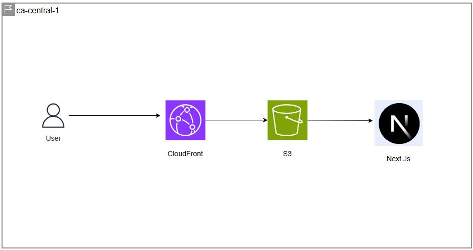

# Terraform Portfolio Project

## Terraform Project Overview and Objectives

A freelance designer has designed a website using Next.js and is looking for a solution to host the website globally with the following requirements:

- Highly available: the website must be highly available worldwide with minimal downtime
- Scalable: it must be able to handle traffic spikes without performance degradation
- Cost-effective: since the freelancer is a self-employed entrepreneur, the website must be cost-effective
- Fast loading: the webpage must load quickly for all visitors globally

## Architecture


## Technologies and Tools Used

- **Terraform:** Infrastructure as Code (IaC) used to provision and manage all AWS resources, with remote state stored in a separate S3 backend bucket using native S3 locking (`use_lockfile = true`)
- **AWS S3:** stores the static website content
- **Bucket Policy:** configured to only allow CloudFront to retrieve static content from the S3 bucket and deliver it to the user
- **CloudFront:** content delivery network (CDN) solution that caches and delivers content through 400+ edge locations worldwide, ensuring high availability and fast loading times
- **Security:**
    - Only accepts GET and HEAD HTTP methods for both allowed and cached behaviors in CloudFront
    - HTTPS ensures secure and encrypted communication between the user and CloudFront
    - S3 bucket is private to prevent users from bypassing CloudFront and accessing the bucket directly
    - Origin Access Control (OAC) authenticates requests from CloudFront to the S3 bucket on cache misses
- **AI:** used to troubleshoot and optimize code, and to research and implement AWS best practices alongside AWS documentation
- **GitHub Actions:** CI/CD pipeline automating infrastructure validation, plan review, and deployment through a pull request workflow

## Business Requirements Solved

- **Cost-effective:** the solution costs less than $1 USD for 20,000 visitors, assuming they are all first-time visitors with no cached content. With caching, the cost is even lower
- **Scalable:** CloudFront automatically scales to handle traffic spikes without any manual intervention. Amazon S3 is also highly scalable with virtually unlimited capacity, requiring no manual intervention
- **Highly available and fast loading:** CloudFront has over 400 edge locations worldwide, eliminating any single point of failure and making it highly available at all times. In addition, CloudFront's caching ability ensures content is served from the nearest edge location, making it very efficient for fast page loading
- **Live Result:** [Website](https://d2s52x98ub4lb7.cloudfront.net/)

## CI/CD Implementation

- Any manual changes to AWS infrastructure, especially for growing businesses, can introduce several risks — including human error, no review process before changes go live, no audit trail of infrastructure changes, and inconsistent environments across deployments.

- The solution is to implement a CI/CD pipeline using GitHub Actions that automates the infrastructure validation and deployment process through a pull request workflow. This ensures all changes are reviewed and tested before reaching production.

- CI/CD pipeline: 
    - The cloud engineer makes infrastructure changes using Terraform and pushes them to a development branch on GitHub
    - The cloud engineer opens a pull request on GitHub, which automatically triggers the CI/CD workflow
    - The workflow triggers the first job, which initializes, formats, and validates the Terraform code
    - The first job will also create an execution plan and display it in a neat and readable format as a PR comment, making it easier for the approver/manager to review the changes
    - The approver/manager reviews the changes and merges the pull request
    - When the pull request is merged into the main branch, a second job is triggered automatically, deploying the updated Terraform infrastructure
    - The second job will deploy the updated infrastructure and invalidate the CloudFront cache, ensuring any changes made to the website are reflected immediately — preventing potential revenue loss when new clients land on the newly updated site

## Installation Instructions

### Prerequisites
- Terraform
- AWS Account
- S3 bucket for backend state storage
- Next.js static site built and ready to upload (`npm run build`)

### Deployment Instructions
1. Clone this repository:
```bash
git clone https://github.com/chaahmad/terraform-portfolio-project.git
```
2. Navigate to the Terraform configuration folder:
```bash
cd terraform-portfolio-project/terraform-nextjs
```
3. Initialize Terraform:
```bash
terraform init
```
4. Deploy the infrastructure:
```bash
terraform plan
terraform apply
```
5. Upload the Next.js static files to S3:
```bash
aws s3 sync ../nextjs-blog/out s3://your-bucket-name
```
6. Access the website:
```bash
terraform output CloudFront_URL
```
### Full write-up
For a detailed breakdown of the architecture, technical decisions, security implementation, and cost analysis, read the full blog post on Medium:
[Blog](https://medium.com/@ahmadchaudhry.ac/from-business-requirements-to-aws-architecture-hosting-a-secure-static-website-for-less-than-cc0296137e64)